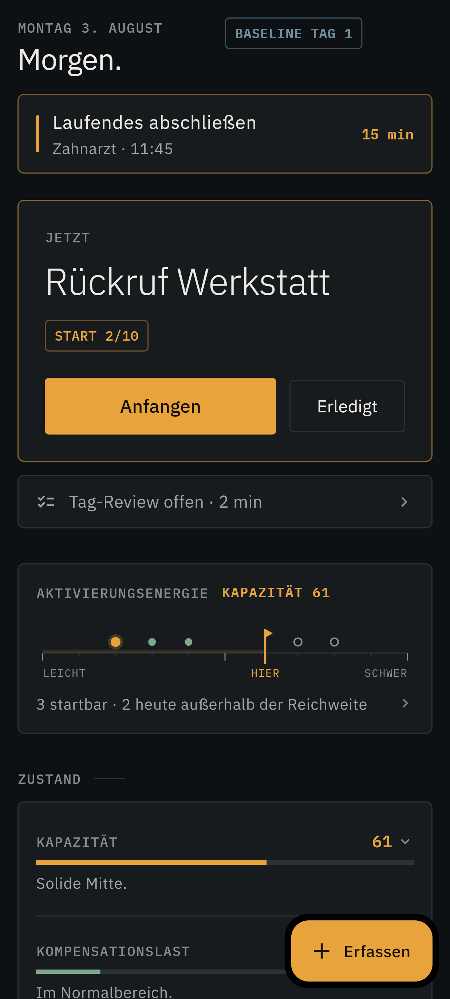
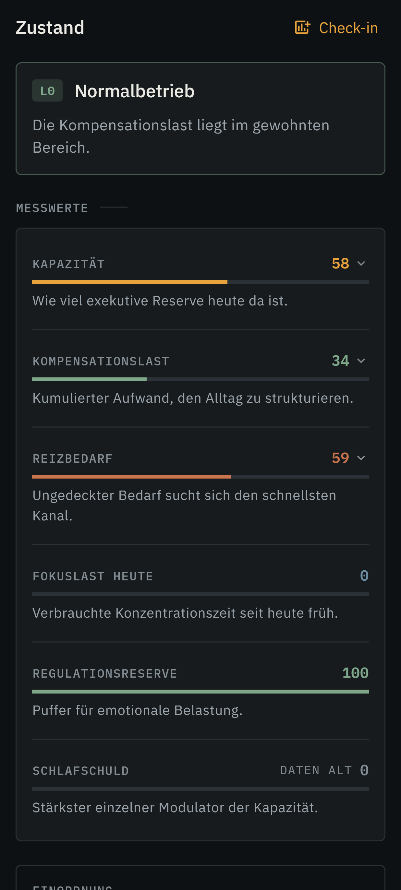
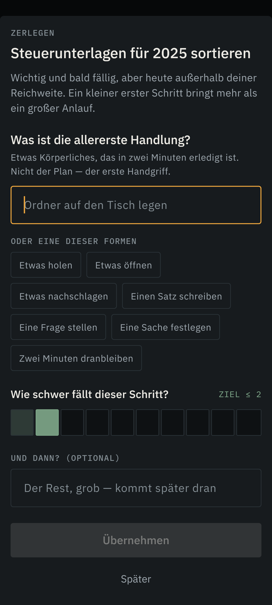
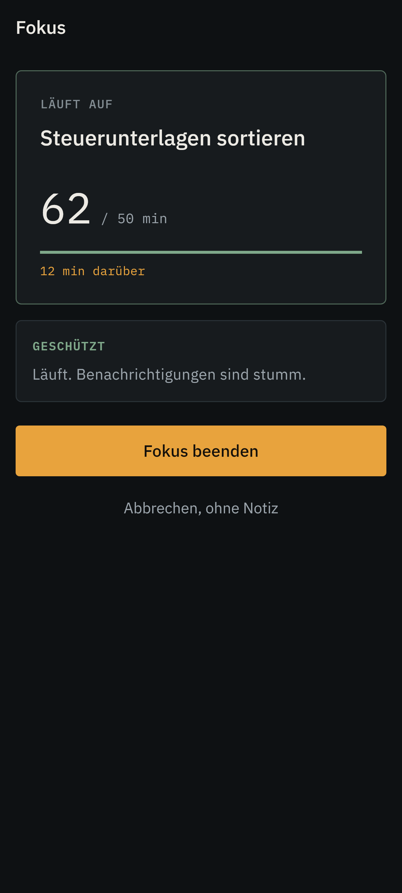
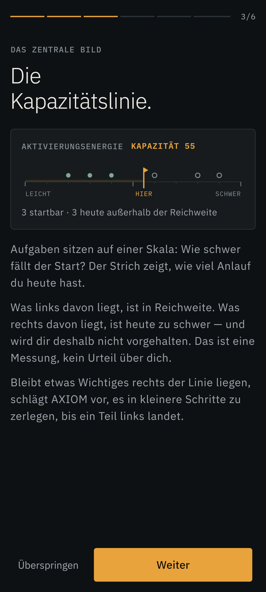
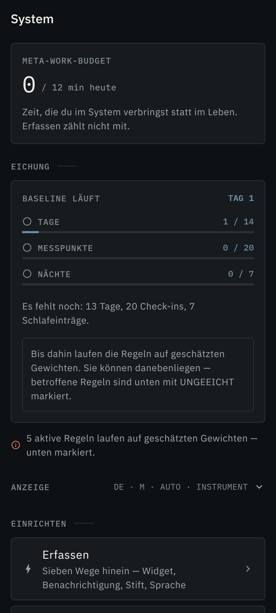
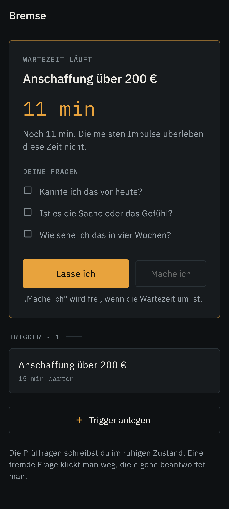
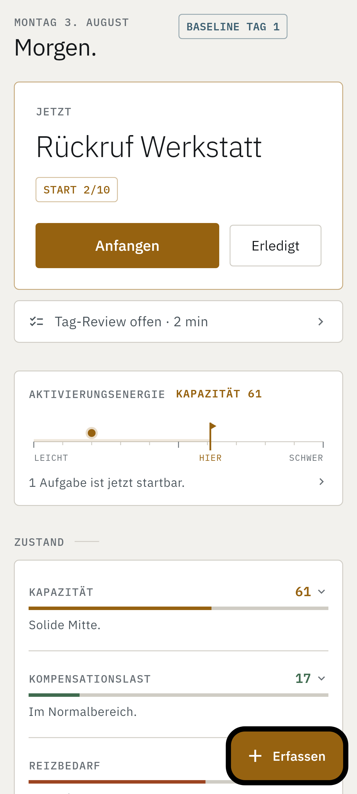

***English** · [Deutsch](README.de.md)*

A deterministic, local-first rule engine for self-regulation.
An exocortex for a highly compensated ADHD profile.

**Private. One user. One device.**

---

> ⚠️ **Not a medical device.** AXIOM is not diagnostics, not therapy, and not a substitute for
> medical or psychotherapeutic treatment. It measures self-reported and device-measured states
> and applies **self-authored** rules to them. Nothing more.

---

## The idea in three sentences

A highly compensated ADHD profile does not fail for lack of structure. It fails because that
structure has to be regenerated in the head every single day. AXIOM takes over the generation:
measure state, apply rules you wrote yourself, output **exactly one** next action — with the
reasoning and the rule ID that produced it.

The measure of success is not "more done". It is **the same output at lower cognitive cost**.

## What that disclaimer means in practice

The banner above is short because it has to be read. Here is what it
actually commits to, so it can be checked rather than believed:

**It is a task list.** With rules, built around how a neurodivergent brain
behaves — but a task list. It does not diagnose, screen, treat, or monitor.

**No clinical anything.** No thresholds from a manual, no assessment score,
no claim that using it improves a condition. `capacity` and `load_index`
are arithmetic over numbers you typed in yourself. They describe a state
inside this app and mean nothing outside it.

**It never advises on medication.** The med module, if you switch it on,
writes down what you tell it. It does not suggest a dose, a time, or a
change — not once, under any circumstances. That is enforced in the code
and in the project's own rules, not left to good intentions.

**It knows when to step back.** The one opinion AXIOM has about your health
is a visible note, after fourteen days at the highest load level,
suggesting a conversation with a person might be worth more than another
rule.

## What makes it different

| A conventional app | AXIOM |
|---|---|
| Asks *what do you want to do?* | Asks *what state are you in?* |
| Models `priority` | Models `activation_energy` against available capacity |
| Shows a list | Shows **one** action + `rule_id` + reasoning |
| Rewards usage | **Caps** usage (meta-guard) |

## The four laws

Any conflict is resolved in favour of these, even against an explicit feature request.

| | Law | In practice |
|---|---|---|
| **G1** | **Offload, don't demand** | No screen that forces thinking. Capture < 3 s, check-in < 15 s, daily review < 2 min. |
| **G2** | **Explainable, not intelligent** | Every output names its `rule_id` and its reasoning. No AI in the decision loop. |
| **G3** | **Channel, don't suppress** | Stimulation need gets a budget, never a moral. No guilt language, no bans — only latency, visibility, alternatives. |
| **G4** | **Self-limiting** | AXIOM caps its own usage time and rations its own configuration. |

G4 is the most important one here. The main risk to this project is not technical failure but
that building the system becomes the procrastination. Which is why the meta-guard was built
first, not last.

## What it does

What follows is organised around what a user runs into, not around module numbers — those live in
[00-KONZEPT](docs/00-KONZEPT.md). Every point below has a longer, illustrated version in the app
itself under *Help*, shipped as plain Markdown in
[`packages/axiom_app/assets/help/en/`](packages/axiom_app/assets/help/en/) — linked per section
below.

### Capture

A few seconds pass between a thought arriving and it being written down; whatever is not caught in
that window is gone. That is why there are seven ways in rather than one, none of them mandatory:
a persistent notification you can type straight into without unlocking the phone, a quick-settings
tile, a home screen widget, a long press on the app icon, `ACTION_SEND` from any other app, the S
Pen's Air Command menu, and the microphone in the input field. Capture asks for nothing beyond the
text — no category, no project, no priority, no date. Sorting happens later, deliberately, not on
impulse. Details: [Capture](packages/axiom_app/assets/help/en/03-erfassen.md).

### One action, never a list

The main screen shows exactly one thing, never several to choose from — choosing is itself the
executive function that is scarce in this profile, and a list does not reduce that load, it
relocates it. What wins, in a fixed order that can be read back: a rule that just fired (an
appointment in ten minutes beats any depth of focus) · a task already in progress · the next
startable task, ranked by consequences, deadline pressure and start energy · a split suggestion,
when nothing is in reach but something is waiting · nothing, when nothing is needed right now.
Three responses exist next to the rule that produced the suggestion — Understood, Later, Doesn't
fit — and none of them produces guilt, a streak or a missed-count. "Doesn't fit" is what the weekly
review later turns into a retire suggestion for the rule behind it. Every output carries its
`rule_id`; every rule is a readable YAML file under version control; `evaluate(state, ruleset) →
decision` is a pure function, same input always giving the same output. Details:
[One action](packages/axiom_app/assets/help/en/04-eine-handlung.md).

### State: capacity, load, regulation

Six readings, each one expandable into how it was calculated: capacity, compensation load,
stimulation need, focus load today, regulation reserve, sleep debt. Capacity decides what is even
shown, and it is made up of sleep debt (30 %), compensation load (25 %), focus load (20 %),
regulation reserve (15 %) and the shape of the day (10 %). Compensation load carries four levels
with real consequences inside the system: at L1 focus blocks cap at 75 minutes, at L2 they cap at
50 and new commitments need confirmation, at L3 — the maintenance mode — everything optional is
hidden and blocks cap at 30 minutes, for 72 hours. Every reading carries a confidence; below it,
rules stay quiet rather than guess. The numbers come from three sources and no others: check-ins,
sleep entries, and — if granted — sleep windows and steps from Health Connect (below). Details:
[State](packages/axiom_app/assets/help/en/05-zustand.md).

### Tasks: start energy, splitting, place, deadline, blockers

There is deliberately no `priority` field. A task carries start energy (1–10 — how hard the cold
start is, not how long the work takes), consequences (what not doing it costs), an optional
deadline and an optional place. Visible is whatever sits below today's capacity; the order among
visible tasks comes from consequences times deadline pressure divided by start energy. A task can
also block another — exactly one relationship, "A blocks B", nothing richer — and a blocked task
is simply waiting, computed from that relationship rather than stored as its own state, so a
finished blocker cannot leave a stale flag behind. A task that is important, urgent and still out
of reach does not get a reminder; it gets a split prompt, and the question is deliberately not
"what does this break into" but "what is the very first two-minute action" — AXIOM proposes no
sub-steps of its own, only the question, a catalogue of shapes, and a check that the step really
sits below the target. For anything with a deadline, a runway is calculated — start energy × 15
minutes plus the estimated work — and shown once it stops fitting before the deadline. Details:
[Tasks](packages/axiom_app/assets/help/en/06-aufgaben.md).

### Time anchors and backward chaining

An appointment does not cost its own length, it costs travel plus getting ready plus a buffer plus
the time it takes to disengage from whatever is currently running — the step the head always
forgets. From those four numbers (20 / 15 / 10 / 10 minutes by default) AXIOM counts backwards
from the appointment to the moment the current activity has to stop, sets an exact alarm on every
step, and surfaces the nearest one at the very top of the main screen, highlighted once it is
inside twenty minutes. It is not a calendar and reads no calendar — only the lead time of an
appointment that is already on one. Details:
[Time anchors](packages/axiom_app/assets/help/en/07-zeitanker.md).

### Focus, stimulation budget, the brake

A focus block runs 15, 25, 50, 75 or 90 minutes — fewer options as compensation load rises — and
the governor protects it, interrupting only for a reason it can name: PROTECTED, NOTE,
INTERRUPTION, STOP NOW, with an appointment always beating a block. Ending one asks for a single
sentence, where it was left, because that note is what makes re-entry cheap, not the timer.
Stimulation need is modelled as a budget, not a failing: channels are self-defined with an
intensity and a typical length, concentrated work earns budget at a rate of 1:3 (ninety minutes of
obligation unlock thirty), and an unplanned slot gets counted, not judged. The brake targets
actions wanted in the moment and often not the next day: a self-written checklist plus a waiting
period (5 to 60 minutes, 24 hours, or until 09:00) sit between the impulse and the action —
"I'll skip it" works immediately, "I'll do it" only once the wait is over. Details:
[Focus, stimulation and the brake](packages/axiom_app/assets/help/en/08-fokus.md).

### Review and calibration

Four reviews, each with a hard time cap that closes it by itself: day (2 min), week (15 min),
month (30 min), quarter (60 min). The weekly one turns a rule's "doesn't fit" responses into a
verdict — RETIRE for a rule that only gets rejected, TOO NARROW for one that never fires, CONFLICT
for two that keep displacing each other. Formula weights start as documented estimates; once
fourteen days, twenty check-ins and seven sleep entries are on record, `tools/bin/calibrate.dart`
proposes real ones from the data — it writes nothing itself — and the weekly review is where a
proposal gets checked before it goes live. Details:
[Review and calibration](packages/axiom_app/assets/help/en/10-rueckblick.md).

### The meta-work cap

This is the part the rest of the project exists to protect, and the reason `docs/07-RISIKEN.md`
names it R1: a systemizing mind can spend indefinitely more time configuring a system than the
system ever saves, because tuning a rule is reliably more stimulating than doing the task the rule
points at. Left unchecked, building AXIOM becomes the procrastination it was meant to solve.

The guard against that was built in Stage 1, before there was a rulebook worth tuning: AXIOM
budgets its own use at twelve minutes a day. Capture does not count; configuration, rule editing
and browsing do. At twelve minutes the rule editor locks itself — for the rest of the day, not
until some future review slot, because a limit you can predict is one you can plan around. The
weekly review makes the trade visible instead of assumed: minutes spent in AXIOM against an
estimate of minutes saved (three per capture, ten per split, four per anchor step reached) — a
number to check the premise against, not to believe on faith. If that ratio tips, that is a system
fault, not a personal one. One thing keeps working regardless of the budget: switching a
misfiring rule off. Letting a rule that is actively wrong run until tomorrow would be the worse
failure.

## Health Connect

Two quantities, read-only, nothing else: sleep windows and daily steps. No heart rate, no weight,
no location — and nothing is ever written back to Health Connect; AXIOM only reads.

**Why it exists.** Sleep debt is the single strongest weight in the capacity formula — 30 %, see
[State](#state-capacity-load-regulation) above — and self-reported sleep is exactly the channel
that fails first under load: on the days a bad night would matter most for a recommendation, a
typed-in entry is the thing most likely to be missing. Reading it from the system closes that
specific gap. It does not add a new one: nothing about the reading is evaluative, and it lands as
the same kind of event a hand-typed sleep entry would.

**How it enters the formula.** An imported sleep window becomes a `sleep_window` event with a
sleep-debt estimate against a seven-hour target, and daily steps become a `health_sample` event —
the same shapes a manual entry produces. `StateDeriver` does not know or care where a reading came
from; Health Connect only changes how many readings exist and how current they are.

**Optional, and not load-bearing.** Nothing fundamental is missing without it, only precision.
Onboarding offers it once, it can be switched on or off at any time under *System → Data sources*,
and the Linux desktop build has no Health Connect at all — it calculates from check-ins alone, same
rules, one source fewer.

**Read-only and idempotent.** The permissions requested are read-only. Every imported record
carries Health Connect's own record ID, and each import checks what is already stored before
writing anything — importing the same window twice changes nothing, which matters because events
in AXIOM are append-only and a duplicate could not be undone. None of it leaves the device: Health
Connect is a local system service, and reading from it does not touch the `INTERNET` permission
discussed below.

Details: [Your data](packages/axiom_app/assets/help/en/12-daten.md).

## Expert mode

Writing rules, seeing the task list with every field, reading the raw event stream — all of that
needs screen area a phone does not have. Expert mode is a small HTTP server the phone runs for its
own browser tab elsewhere on the same network: **off until switched on**, and working against the
phone's real, live database rather than a copy.

**A full client, not a read-only mirror.** The browser shows the same one action and the same
ranking the phone would show — a fired rule, then whatever is running, then the next startable
task — plus what the phone deliberately does not: the whole task tree with blockers and splitting,
a board view of the stock, the rulebook as editable YAML, the weekly review, the raw event stream,
and the help pages. G1 still applies: the ordering is identical, and the full list sits next to it
as what it is — stock, not a choice being offered.

**Getting in.** Starting the server (*System → Expert mode → Start server*) shows an address —
usually `axiom.local`, resolved via multicast DNS so the name survives the router reassigning an
IP address, plus a raw IP as fallback — a fingerprint, and from then on a **number comparison** is
the primary way to sign in: opening the address shows a two-digit number in the browser, the same
number appears on the phone next to "matches" and "doesn't match". The safety is in the comparison,
not the tap — if someone else is asking to sign in at the same moment, their number shows up on the
phone, not on the screen the user is looking at, so confirming only what genuinely matches never
lets a second party in. A six-digit PIN, generated fresh per run and shown only in the app, is the
second way in, for a browser that cannot show the live number. Either way a session is an
`HttpOnly` cookie; the PIN and the comparison code never appear in a URL.

**The other comparison.** The browser will warn once, because the certificate is self-signed and
no outside authority vouches for it — the point is not to click the warning away but to compare:
the same SHA-256 fingerprint is shown in the app and under the browser's "view certificate". If
they match, the connection goes to this phone and nothing sits between. The certificate is
generated once on the device and reused across restarts, so the warning is a one-time check rather
than a reflex trained to be dismissed.

**Starting and stopping.** No autostart at boot, ever. Optionally — off by default — the server can
come up whenever the app itself is opened, for the case where the phone is in a pocket at a desk
and a server nobody remembers to switch on does not get used; every other guardrail below still
applies unchanged in that mode. It stops itself after five wrong PINs or rejected sign-ins, after
thirty minutes without a request, from a button in the app or on its own persistent notification —
which is up the whole time it runs, naming the address, so its state is never something to guess
at — and always when the app is closed.

**The name on the network.** So `axiom.local` resolves, the phone answers name queries on the
local network by multicast DNS — the one place AXIOM sends a packet on its own initiative. That
packet carries only this device's name and IP address, goes only to the link-local multicast
group that no router forwards beyond the local segment, exists only while the server runs, and is
withdrawn with a goodbye packet when it stops.

**The honest price.** Expert mode is why AXIOM declares the `INTERNET` permission at all. The
earlier, structural guarantee — that the operating system itself made an outbound connection
impossible — no longer holds. What replaces it is narrower and tested rather than assumed:
**AXIOM listens, but never calls out.** There is no HTTP client anywhere in the app and no
outbound call in its own code; `language_test.dart` forbids `package:http`, `HttpClient`,
`Socket.connect`, `WebSocket.connect` and `dart:html` across the whole app, and pins down that
exactly one file opens a socket at all — the server, and the mDNS responder above it, both only to
listen or to announce.

This paragraph used to add "no SDK that could open one". It should not have. `basic_utils`, which
generates expert mode's certificate, pulls in `package:http` transitively, and its umbrella
library exports `HttpUtils` and `DnsUtils` (DNS over HTTPS against Google and Cloudflare) into
every namespace that imports it. Nothing calls them — but "could not" was a stronger claim than
anything under test. Since then `language_test.dart` forbids both entry points by name and
rejects any network client as a *direct* dependency, so the guarantee is what it says on the tin:
not impossible, but checked. See [ADR-0005](docs/adr/ADR-0005-expertenmodus.md) for the full
reasoning, including why this was judged worth the permission and what would have to change for
that judgement to be revisited.

## Documentation

| Document | Contents |
|---|---|
| [00-KONZEPT](docs/00-KONZEPT.md) | What AXIOM is, the four laws, all 13 modules |
| [01-PROFIL-DEFIZITE](docs/01-PROFIL-DEFIZITE.md) | Target profile D1–D12 — the basis for everything |
| [02-ARCHITEKTUR](docs/02-ARCHITEKTUR.md) | Layers, ports, evaluation cycle |
| [03-DATENMODELL](docs/03-DATENMODELL.md) | Events, state vector, task, formulas |
| [04-REGELWERK](docs/04-REGELWERK.md) | Rule DSL, semantics, conflict resolution |
| [05-ROADMAP](docs/05-ROADMAP.md) | Stages S1–S4 with stop criteria |
| [06-METRIKEN](docs/06-METRIKEN.md) | Success measurement, baseline protocol |
| [07-RISIKEN](docs/07-RISIKEN.md) | What goes wrong — R1 is the decisive one |
| [08-GERAET-S25U](docs/08-GERAET-S25U.md) | S Pen, Health Connect, Android pitfalls |
| [ADR](docs/adr/) | Architecture decisions, with reasoning — 0005 is the one that changed |
| [BACKLOG](docs/BACKLOG.md) | Ideas deliberately *not* built yet |

The documentation is in German — it predates the decision to publish, and translating it would
cost more than it returns. The code, identifiers and this README are English.

The table above is the *design* documentation — why AXIOM is built the way it is. The *user*
documentation — what each screen does, in English, with screenshots — ships inside the app under
*Help* and lives as plain Markdown in
[`packages/axiom_app/assets/help/en/`](packages/axiom_app/assets/help/en/00-index.md); the "What
it does" section above links into it chapter by chapter.

For Claude Code: [CLAUDE.md](CLAUDE.md).

## Stack

Flutter 3.44 / Dart 3.12 · SQLite (SQLite3MultipleCiphers) · YAML rulebook under git
Targets: Android (Galaxy S25 Ultra, primary) and Linux desktop (companion)

## Layout

```
packages/axiom_core   pure Dart — domain + state engine + rule engine   ← the heart
packages/axiom_data   SQLite, YAML loader, export
packages/axiom_app    Flutter UI, notifications, widgets, Health Connect
rules/core            shipped rules (versioned)
rules/personal        personal rules (git-ignored)
tools/                validator, layering check, calibration
```

Dependencies point **inwards, always**. `axiom_core` has no Flutter, no platform and no I/O
dependency — no `DateTime.now()`, no `Random()`, both injected as ports. Without that, rules are
not deterministically testable, and determinism is what G2 rests on.
`dart run tools/bin/check_layering.dart .` fails the build on violations.

## Development

```bash
# Checks — all of these must be green
dart run tools/bin/validate_rules.dart rules
dart run tools/bin/check_layering.dart .
(cd packages/axiom_core && dart analyze && dart test)
(cd packages/axiom_data && dart analyze && dart test)
(cd packages/axiom_app  && flutter analyze && flutter test)

# Mirror the rulebook into app assets — before every app build
dart run tools/bin/sync_rules.dart

# Run
(cd packages/axiom_app && flutter run -d linux)
(cd packages/axiom_app && flutter run -d <device>)     # adb devices
```

### Signing a release build

`flutter build apk --release` works without setup, but falls back to the
Android debug key and says so in the build log. That key is on every machine
with Flutter installed, so anything signed with it can be replaced by anyone.

For a real key, create `packages/axiom_app/android/key.properties` — it is
git-ignored, along with `*.p12` and `*.jks`:

```properties
storeFile=axiom-release.p12
storePassword=…
keyAlias=axiom
keyPassword=…
```

```bash
keytool -genkeypair -v -keystore axiom-release.p12 -storetype PKCS12 \
  -keyalg RSA -keysize 4096 -validity 10950 -alias axiom
```

Keep the keystore. Without it no build can be installed over an existing one
— only uninstall and reinstall, and that wipes the database. Export first
(*System → Data*).

## Status

**S1 through S4 are in place.** The Android APK and the Linux desktop build and run.

| | |
|---|---|
| Tests | green in all three packages — `dart test` in core and data, `flutter test` in app |
| Analyzer | clean across all packages |
| Rulebook | 18 rules valid, 15 active — 5 of them **uncalibrated** (`dart run tools/bin/validate_rules.dart rules`) |
| Release APK | built, **with the `INTERNET` permission** — declared for expert mode only (ADR-0005), no other network code in the app |

That first row used to carry an exact test count. Every number in it had drifted — in a README
whose whole pitch is that its claims can be checked. A number nobody re-measures ages badly, so
what stands here now is the command that produces it.

**Stage 1** — capture (< 3 s), check-in, capacity line, state view with derivation, rule
inspector, meta-guard, onboarding, home screen widget, quick settings tile, exact alarms, app
shortcuts, share target.

**Stage 2** — time anchors with backward chaining (M3), atomizer (M2), body signals (M7),
evening cutoff and sleep logging (M8), review with an enforced time cap (M11).

**Stage 3** — focus governor (M4), stimulation budget with the slot as currency (M5), impulse
brake with a self-written checklist (M6), load monitor with real consequences up to maintenance
mode (M9).

**Stage 4** — signal log with capture and hindsight kept apart (M10), active-window log (M13,
opt-in), encrypted data sync by file instead of by server.

**Platform integration** — live update of the running focus slot in the status bar chip, on the
lock screen and in Samsung's Now bar (Android 16, `ProgressStyle` + `requestPromotedOngoing`);
Health Connect for sleep windows and daily steps, imported idempotently; Direct Share as a fixed
target in the share sheet.

### The rule editor

Rules can be written on the device (*System → Rulebook*). Not a text box: the editor knows the
engine's vocabulary, so it only offers what the engine can resolve — and it evaluates every
condition against the **current** state while you type. Each line shows what the value is right
now and whether that part holds.

Two guardrails are enforced in code, not suggested:

- Every saved rule runs as `log_only` for **seven days**, whatever severity was chosen. A rule
  that goes live the day it is written gets judged on the day you were convinced it was right.
- `rationale` and `cooldown` are required. Without reasoning an output is not auditable (G2);
  without a cooldown you get a flood of notifications — the most common way apps like this die.

Edits live as an overlay in the database, never in `rules/core/`. `ruleToYaml` returns a rule in
exactly the form `rules/` uses, so anything written on the phone can be copied back into version
control. A round-trip test keeps that honest.

### Expert mode, in short

Covered in full above under [Expert mode](#expert-mode) — a local HTTP server the phone runs only
on command, giving a browser on the same network a full client against the phone's real data.
Sync itself still needs no server: events are immutable, so their union is conflict-free and a
repeated import is idempotent. Two devices converge over an encrypted file.

### Two languages

German is the source, English is the translation — switchable under *System → Display*. The
notable part: **the German sentence is the key**.

```dart
Text(context.t('Nichts in Reichweite'))
```

That keeps the wording legible where it was chosen. Which matters here more than usual:
"Nothing in reach" is a deliberate choice against "You have 14 open tasks", and that choice
should not disappear behind an identifier like `now.emptyTitle`.

Four layers are covered:

| Layer | Where | How |
|---|---|---|
| Interface | `lib/i18n/en.dart` | German sentence → English sentence |
| Core | `Phrase('{0} min über …', [n])` | source and values kept apart, so numbers never have to be recovered from a finished sentence |
| Rulebook | `title_en`, `rationale_en` in the YAML | rules are data; so are their translations |
| Expert mode | `assets/expert/index.html` | same rule, in the browser: `tr('…')` and a `data-t` attribute for fixed markup. The page follows the **phone's** setting, not the browser's — otherwise you read the same sentence two different ways on two screens |

`i18n_test.dart` pins down three things: **every** translatable text has an English version, the
placeholders match on both sides, and the tone holds — no guilt language, no exclamation marks.
That last one is the actual reason for the test. A translation can turn a measurement into a
verdict without anyone noticing.

### Ways into the app

Between the thought and the note there are a few seconds. What is not held in that time is gone
(D9) — so there is not one route but seven. They are listed in the app under *System → Capture*,
with setup instructions.

| Route | Friction | How |
|---|---|---|
| **Ongoing notification** | minimal | type straight into the notification, no unlock (`RemoteInput`) |
| Quick settings tile | very low | one tap from any app |
| Home screen widget | low | next action + capacity, tap goes to the input field |
| App shortcut | low | long press on the icon |
| Share from other apps | low | `ACTION_SEND`, plus Direct Share |
| S Pen | low | Air command shortcut; `ACTION_CREATE_NOTE` is wired up, but One UI does not expose the role |
| Voice | low | `actions.intent.CREATE_NOTE` for Assistant, Bixby routine |

Platform limits, named explicitly rather than worked around:

- **Android has no lock screen widgets** — removed in 5.0. The remaining route to permanent
  visibility while locked is the ongoing notification (`VISIBILITY_PUBLIC`).
- **Samsung Notes has no public interface.** Screen-off memos stay there. The official pen route
  is `ACTION_CREATE_NOTE`.
- **The S25 Ultra's S Pen has no Bluetooth**, so Air Actions do not exist on it — for any app, not
  only this one. What remains is pulling out the pen and tapping AXIOM in the Air Command menu,
  which is two moves once registered as a shortcut.
- **"Hey Google, note in AXIOM" does not work.** Assistant voice commands require distribution
  through Google Play, and a self-installed app is not signature-verified by Google. The
  microphone in the capture field, a Bixby routine, or an `axiom://capture?text=…` link work
  instead.

### Calibration

The formula weights in `rules/core/weights.yaml` are estimated, not measured. Five active rules
(R-020, R-050, R-051, R-052, R-090) test derived values and can therefore be wrong. They run
anyway — a deliberate decision. The system inspector marks them **UNCALIBRATED**.

**Where to see the state:** in the app under *System → Calibration*. Three conditions with
progress, and once all of them are met, the full procedure with copyable commands.

| Condition | Needed | Why |
|---|---|---|
| Days | 14 | Anything shorter misses a full weekly rhythm |
| Readings | 20 check-ins | Below that the circadian profile does not hold |
| Nights | 7 sleep entries | For the sleep–capacity coupling |

**Time alone is not enough.** Fourteen days with five check-ins would calibrate the weights on
noise — worse than an honest estimate. So all three are checked and shown separately.

```bash
adb exec-out run-as de.atomfritte.axiom cat files/axiom.db > axiom.db
dart run tools/bin/calibrate.dart axiom.db      # writes nothing, only proposes
# Review the proposals in the weekly review, then enter them in
# rules/core/weights.yaml and set calibration.status to calibrated:
dart run tools/bin/sync_rules.dart
```

## What it looks like

<p>
  
  
  
  
</p>
<p>
  
  
  
  
</p>

Left to right: **one action** with the rule that produced it · the **state** behind it, every
number expandable into its formula · **splitting** something out of reach into a first step ·
a **running focus block**. Below: the capacity line explained during onboarding · the **rule
inspector** · the **impulse brake** with your own questions · the same main screen in light mode.

These are not marketing shots. They are the golden files from
`packages/axiom_app/test/screenshots/`, produced by the test suite — which means they cannot
drift from the code without a test going red.

## The mark

A scale with one threshold set on it. Left, solid: what is in reach. Right, dimmed: what is
beyond today. That is the core image of the app — and it is what an axiom is: a boundary you
set, not one you derive.

No brain, no lightbulb, no checkmark, no finish flag. The mark comes from the world of measuring
instruments, not from the visual language of self-optimisation apps.

Sources in `assets/brand/`. The Android icons are generated from them:

```bash
tools/bin/make-icons.sh
```

## Licence

[PolyForm Strict 1.0.0](LICENSE.md) — deliberately not an open-source licence.

You may read this code and run it privately for noncommercial purposes. You may not redistribute
it and you may not build your own thing on top of it. Copyright and every commercial right stay
with the author.

Third-party components keep their own licences and all permit this use; the obligations, and the
one that needed action, are listed in [THIRD-PARTY-LICENCES.md](THIRD-PARTY-LICENCES.md).
